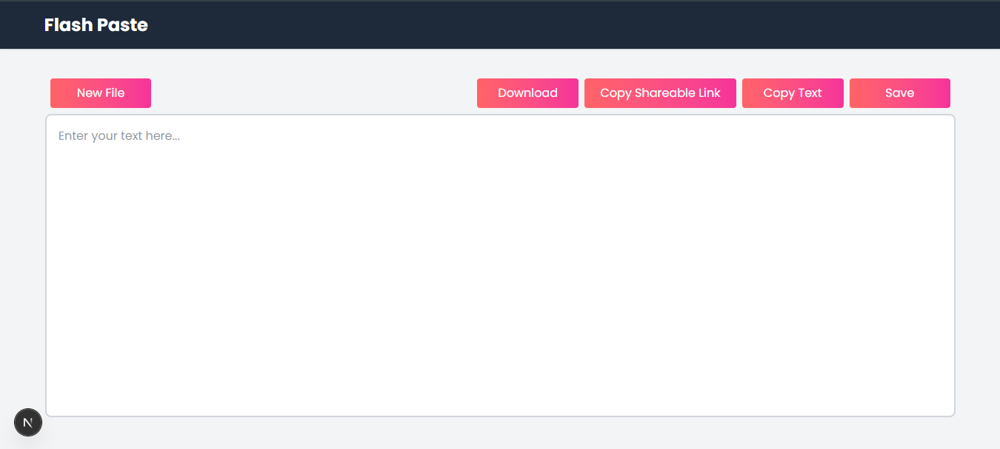

# My Project

This is a Next.js project using MongoDB as the database.

## 🚀 Getting Started

Follow these steps to set up and run the project locally:

### 1. Clone the Repository

```bash
git clone https://github.com/SyedAbdullahAhmed/FlashPaste.git
cd FlashPaste
```

### 2. Install Dependencies

```bash
npm install
```

### 3. Add MongoDB URI

Create a `.env` file in the root directory and add your MongoDB connection string:

```env
MONGODB_URI=your_mongodb_connection_string
```

> Replace `your_mongodb_connection_string` with your actual MongoDB connection URI.

### 4. Run the Development Server

```bash
npm run dev
```

Open [http://localhost:3000](http://localhost:3000) in your browser to see the result.

---

## 🛠 Tech Stack

- Next.js
- React
- MongoDB
- Mongoose


## 📄 License

MIT
